# IAM User Creation with Access Keys - Step by Step Guide

This comprehensive guide walks you through creating an IAM user with programmatic access keys in AWS. You'll learn how to set up a new user, configure permissions, and generate secure access credentials for API/CLI access.

## What You'll Learn

- How to navigate the IAM dashboard
- Step-by-step user creation process
- How to configure access types and permissions
- Best practices for access key management
- Security considerations for programmatic access

## Prerequisites

- AWS account with administrative access
- Understanding of [IAM fundamentals](00-iam-fundamentals.md)
- Browser access to AWS Management Console

---

# 📋 Process Overview

```mermaid
flowchart TD
    A["🚀 Start IAM User Creation Process"] --> B["Step 1: Access IAM Dashboard<br/>📸 user-1.png"]
    B --> C["Step 2: Create New User<br/>📸 user-2.png"]
    C --> D["Step 3: Set User Details & Permissions<br/>📸 user-3.png"]
    D --> E["Step 4: Configure Access Type<br/>📸 user-4.png"]
    E --> F["Step 5: Review User Configuration<br/>📸 user-5.png"]
    F --> G["Step 6: Generate Access Keys<br/>📸 image-6.png"]
    G --> H["✅ IAM User Creation Complete"]
    
    style A fill:#e1f5fe
    style H fill:#e8f5e8
    style B fill:#fff3e0
    style C fill:#fff3e0
    style D fill:#fff3e0
    style E fill:#fff3e0
    style F fill:#fff3e0
    style G fill:#fff3e0
```

---

# 🛠️ Step-by-Step Implementation

## Step 1: Access IAM Dashboard

Navigate to the AWS IAM service to begin creating your new user.

### Actions to Take:
1. **Sign in** to the AWS Management Console
2. **Search** for "IAM" in the services search bar
3. **Click** on "IAM" to access the Identity and Access Management dashboard
4. **Review** the IAM dashboard overview and navigation options

### Key Points:
- Ensure you're using an account with IAM user creation permissions
- The IAM dashboard provides access to users, groups, roles, and policies
- Take note of the current number of users in your account

---

## Step 2: Create New User

Initiate the user creation process from the IAM dashboard.

### Actions to Take:
1. **Click** on "Users" in the left navigation panel
2. **Select** "Add user" or "Create user" button
3. **Review** existing users (if any) to avoid naming conflicts
4. **Prepare** to enter user details in the next step

### Key Points:
- The Users section shows all existing IAM users
- Each user is listed with their creation date and attached policies
- You can manage existing users or create new ones from this interface

---

## Step 3: Set User Details & Permissions

Configure the basic user information and initial permission settings.

### Actions to Take:
1. **Enter** a unique username for the new user
   - Use descriptive names (e.g., `john-developer`, `api-service-user`)
   - Follow your organization's naming conventions
2. **Choose** access type options:
   - **Console access**: For human users who need web console access
   - **Programmatic access**: For applications needing API/CLI access
3. **Set** console password (if console access enabled):
   - Generate automatic password or create custom password
   - Decide if user must reset password on first login
4. **Configure** initial permissions:
   - Add user to existing groups
   - Attach policies directly
   - Copy permissions from existing user

### Best Practices:
- **Use descriptive usernames** that indicate the user's purpose
- **Apply least privilege principle** - grant minimum necessary permissions
- **Prefer group-based permissions** over direct policy attachments
- **Enable password reset requirement** for human users

---

## Step 4: Configure Access Type

Specify the type of access the user needs and configure security settings.

### Actions to Take:
1. **Select Access Type**:
   - ✅ **Programmatic access**: Generates access key ID and secret access key
   - ⬜ **Console access**: Allows AWS Management Console login
   - ✅ **Both**: If user needs both API and console access

2. **Configure Console Access** (if selected):
   - **Password type**: Auto-generated or custom
   - **Password reset**: Require password change on first login
   - **Multi-factor authentication**: Enable MFA for enhanced security

3. **Set Permissions**:
   - **Add to group**: Recommended approach for permission management
   - **Attach policies directly**: For specific use cases
   - **Copy permissions**: From existing user with similar needs

### Security Considerations:
- **Programmatic access** is ideal for applications, scripts, and CLI usage
- **Console access** should be limited to human users who need web interface
- **MFA should be mandatory** for all human users with console access
- **Groups provide better permission management** than direct policy attachment

---

## Step 5: Review User Configuration

Verify all settings before creating the user.

### Actions to Take:
1. **Review User Details**:
   - Username correctness
   - Access type selections
   - Permission assignments

2. **Verify Security Settings**:
   - Password policy compliance
   - MFA requirements
   - Permission scope

3. **Check Permission Summary**:
   - Attached policies
   - Group memberships
   - Effective permissions

4. **Add Tags** (optional but recommended):
   - Environment tags (dev, staging, prod)
   - Department or team tags
   - Purpose or project tags

5. **Create User**: Click "Create user" to finalize

### Final Checks:
- ✅ Username follows naming conventions
- ✅ Access type matches intended usage
- ✅ Permissions follow least privilege principle
- ✅ Security settings are appropriate
- ✅ Tags are added for better organization

---

## Step 6: Generate and Secure Access Keys

Obtain and securely store the user's access credentials.

### Actions to Take:
1. **Download Credentials**:
   - Click "Download .csv" to save credentials securely
   - Note the Access Key ID and Secret Access Key
   - **This is the only time you can view the Secret Access Key**

2. **Secure Storage**:
   - Store credentials in a secure password manager
   - Never commit access keys to version control
   - Consider using AWS Secrets Manager for application credentials

3. **Test Access** (recommended):
   - Configure AWS CLI with new credentials
   - Test basic AWS commands to verify access
   - Confirm permissions work as expected

4. **Send Credentials Securely**:
   - Use secure channels to share credentials with users
   - Consider temporary credentials for initial setup
   - Provide setup instructions for AWS CLI/SDK

### 🚨 Critical Security Actions:
- **Download the CSV file immediately** - you cannot retrieve the secret key later
- **Store credentials securely** - never share via email or unsecured channels
- **Test the credentials** to ensure they work before distributing
- **Document the user's purpose** for future reference

---

# 🔒 Security Best Practices

## Access Key Management

### ✅ **Do's**
- **Rotate access keys regularly** (every 90 days minimum)
- **Use IAM roles** instead of access keys when possible
- **Store keys securely** using credential management tools
- **Monitor key usage** through CloudTrail logs
- **Apply least privilege** permissions

### ❌ **Don'ts**
- **Never hardcode** access keys in application code
- **Don't share** access keys between users or applications
- **Avoid long-term keys** for temporary access needs
- **Don't commit** keys to version control systems
- **Never expose** keys in logs or error messages

## Monitoring and Compliance

### Regular Security Audits
- **Review user access** quarterly
- **Check for unused credentials** and deactivate them
- **Monitor suspicious activity** through CloudTrail
- **Verify MFA compliance** for all human users
- **Audit permission assignments** for appropriateness

### Access Key Rotation Process
1. **Create new access key** for the user
2. **Update applications** to use new key
3. **Test functionality** with new credentials
4. **Delete old access key** after verification
5. **Document the rotation** in your security logs

---

# 🔧 Post-Creation Tasks

## For Human Users

### Initial Setup
- [ ] Provide secure access to credentials
- [ ] Send setup instructions for AWS CLI
- [ ] Require MFA setup for console access
- [ ] Provide relevant documentation and training
- [ ] Test access with user to ensure functionality

### Ongoing Management
- [ ] Schedule regular access reviews
- [ ] Monitor usage patterns
- [ ] Update permissions as role changes
- [ ] Ensure compliance with security policies

## For Application Users

### Integration Setup
- [ ] Configure application with new credentials
- [ ] Test all required AWS service interactions
- [ ] Implement proper error handling
- [ ] Set up monitoring and alerting
- [ ] Document the integration

### Security Hardening
- [ ] Use environment variables for credentials
- [ ] Implement credential rotation mechanism
- [ ] Monitor API usage patterns
- [ ] Set up alerts for unusual activity
- [ ] Regular security assessments

---

# 🚨 Troubleshooting Common Issues

## Access Denied Errors

### Symptoms
- API calls return "Access Denied" errors
- User cannot perform expected actions
- CLI commands fail with permission errors

### Solutions
1. **Check IAM policies** attached to user/groups
2. **Verify resource-based policies** (S3 bucket policies, etc.)
3. **Confirm no explicit DENY** statements
4. **Test with IAM Policy Simulator**
5. **Check service-specific quotas** and limits

## Invalid Credentials

### Symptoms
- "Invalid access key" errors
- Authentication failures
- CLI configuration issues

### Solutions
1. **Verify access key format** (correct copying)
2. **Check if keys are active** in IAM console
3. **Confirm region settings** in CLI/SDK
4. **Test with temporary credentials** to isolate issue
5. **Regenerate access keys** if necessary

## MFA Requirements

### Symptoms
- Operations require MFA but user doesn't have it
- Temporary credential issues
- Console access problems

### Solutions
1. **Set up MFA device** for the user
2. **Configure MFA in applications** using STS
3. **Update IAM policies** to require MFA appropriately
4. **Test MFA workflow** end-to-end

---

# 📚 Related Resources

## AWS Documentation
- [IAM User Guide](https://docs.aws.amazon.com/IAM/latest/UserGuide/)
- [AWS CLI Configuration](https://docs.aws.amazon.com/cli/latest/userguide/cli-configure-files.html)
- [IAM Best Practices](https://docs.aws.amazon.com/IAM/latest/UserGuide/best-practices.html)

## Security Guides
- [IAM Security Best Practices](00-iam-fundamentals.md#iam-security-best-practices)
- [Access Key Management](https://docs.aws.amazon.com/IAM/latest/UserGuide/id_credentials_access-keys.html)
- [MFA Setup Guide](https://docs.aws.amazon.com/IAM/latest/UserGuide/id_credentials_mfa.html)

## Tools and Utilities
- [AWS CLI](https://aws.amazon.com/cli/)
- [AWS SDKs](https://aws.amazon.com/tools/)
- [IAM Policy Simulator](https://policysim.aws.amazon.com/)
- [AWS CloudTrail](https://aws.amazon.com/cloudtrail/)

---

# ✅ Summary

You have successfully created an IAM user with programmatic access! Here's what you accomplished:

## ✅ **Completed Tasks**
- ✅ Navigated to IAM dashboard
- ✅ Created new IAM user with appropriate name
- ✅ Configured access type and permissions
- ✅ Generated secure access keys
- ✅ Downloaded and secured credentials
- ✅ Applied security best practices

## 🎯 **Next Steps**
1. **Configure AWS CLI** with the new credentials
2. **Test the user's permissions** with sample commands
3. **Implement access key rotation** schedule
4. **Monitor usage** through CloudTrail
5. **Review and adjust permissions** as needed

## 🔒 **Security Reminders**
- Store access keys securely and never share them
- Rotate credentials regularly (every 90 days)
- Monitor usage for unusual activity
- Apply least privilege principle consistently
- Use IAM roles instead of access keys when possible

Your new IAM user is ready for secure programmatic access to AWS services!
