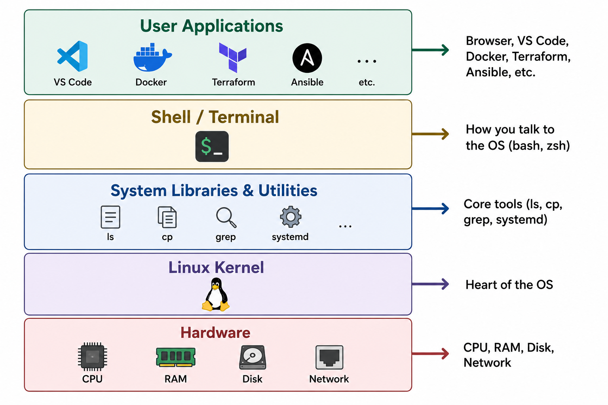

# What is Linux?

You've probably heard people say *"the server runs on Linux"* or *"deploy it on a Linux box."* But what exactly is Linux?

Let's break it down.

---

## The Short Answer

**Linux is an open-source operating system kernel** — the core engine that sits between your hardware (CPU, RAM, disk) and the software you run on top of it.

When people casually say "Linux," they usually mean a **complete operating system built around the Linux kernel** — which includes the kernel, system utilities, a shell, package managers, and more. The technically precise term for this full package is a **Linux distribution** (or *distro*).

---

## Kernel vs Operating System — What's the Difference?

Think of a car:

| Part | Analogy | In Linux |
|------|---------|----------|
| **Engine** | Powers the car, you never touch it directly | **Linux Kernel** — manages hardware, memory, processes |
| **Dashboard, Steering, Pedals** | How you interact with the car | **Shell, Utilities, GUI** — how you interact with the system |
| **The Full Car** | Engine + body + interior + everything | **Linux Distribution** — kernel + tools + package manager + config |

The **kernel** alone isn't usable by end users. You need the full distribution — the "complete car" — to actually work with it.

---

## A Bit of History (The Fun Version)

| Year | What Happened |
|------|---------------|
| **1991** | **Linus Torvalds**, a 21-year-old Finnish student, posts a message: *"I'm doing a (free) operating system — just a hobby, won't be big and professional."* That "hobby" became Linux. |
| **1991–1993** | Developers worldwide start contributing. The kernel grows rapidly. |
| **1993** | First polished distributions appear — **Debian** and **Slackware**. |
| **2004** | **Ubuntu** launches, making Linux accessible to everyday users. |
| **Today** | Linux runs on **everything** — 96%+ of the world's top servers, Android phones, smart TVs, routers, supercomputers, and even Mars rovers. |

> 💡 The name **Linux** comes from **Linus + Unix** — because Torvalds was inspired by Unix, a powerful OS from the 1970s.

---

## The Building Blocks of a Linux System

Here's what makes up a typical Linux system, from bottom to top:

  

### What the Kernel Actually Does

The kernel is responsible for four critical jobs:

1. **Process Management** — Decides which programs get CPU time and when
2. **Memory Management** — Allocates RAM to programs, prevents them from stepping on each other
3. **Device Management** — Talks to hardware (disks, network cards, USB devices) through drivers
4. **File System Management** — Organizes how data is stored and retrieved on disk

You never interact with the kernel directly. Instead, you use the **shell** (terminal) or applications, and *they* talk to the kernel on your behalf.

---

## Open Source — Why It Matters

Linux is released under the **GNU General Public License (GPL)**, which means:

- ✅ **Anyone can view the source code** — No hidden secrets. You can read every line of code that runs your server.
- ✅ **Anyone can modify it** — Don't like how something works? Change it.
- ✅ **Anyone can distribute it** — You can build your own Linux distribution if you want.
- ✅ **It's free** — No licensing fees, ever.

This is fundamentally different from **Windows** or **macOS**, where the source code is proprietary and controlled by a single company.

### Why does this matter in the real world?

- Companies don't pay per-server license fees → **massive cost savings at scale**
- Security researchers can audit the code → **vulnerabilities get found and fixed fast**
- Thousands of developers contribute → **rapid innovation and stability**

---

## Linux vs Windows vs macOS — At a Glance

| Aspect | Linux | Windows | macOS |
|--------|-------|---------|-------|
| **Source Code** | Open source | Proprietary | Proprietary (Darwin kernel is partly open) |
| **Cost** | Free | Paid license | Included with Apple hardware |
| **Primary Use** | Servers, DevOps, cloud, embedded | Desktop, enterprise, gaming | Creative work, development |
| **Server Market Share** | ~96%+ | ~4% | Negligible |
| **Customizability** | Extremely high | Limited | Limited |
| **Package Management** | `apt`, `yum`, `dnf`, etc. | Manual installers / winget | `brew` (third-party) |
| **Default Shell** | Bash / Zsh | PowerShell / CMD | Zsh |
| **Used By** | AWS, Google, Netflix, NASA | Corporate desktops | Designers, developers |

---

## Key Takeaways

- **Linux is a kernel**, not a complete OS by itself. A full OS = kernel + tools + shell = **distribution**.
- It was created in **1991 by Linus Torvalds** and is now maintained by thousands of contributors.
- It's **open source and free** — no licensing costs, full transparency.
- Linux powers the **vast majority of the internet's infrastructure** — if you're deploying applications, you're almost certainly deploying to Linux.
- Understanding Linux is a **foundational skill** for any DevOps engineer, cloud engineer, or backend developer.

---

**Next →** [Why Linux is Preferred for Application Deployment](./02-why-linux-for-deployment.md)
