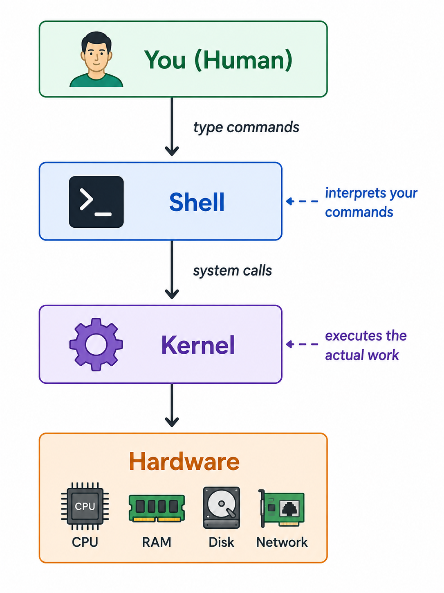

# Introduction to the Shell / Terminal

When you connect to a Linux server — say, an EC2 instance via SSH — there's no desktop, no icons, no mouse. You get a **blinking cursor on a black screen**. That's the **shell**.

It might look intimidating at first, but the shell is the single most powerful tool you'll use as a DevOps engineer. Let's understand what it actually is.

---

## What is the Shell?

The **shell** is a program that takes commands you type and passes them to the operating system to execute. It's the **middleman** between you and the Linux kernel.

<div align="center">
  
</div>

When you type `ls` and press Enter:
1. The **shell** reads your input
2. It finds the `ls` program on disk
3. It asks the **kernel** to run it
4. The kernel talks to the **hardware** (disk) to list files
5. The result comes back through the kernel → shell → your screen

---

## Shell vs Terminal — Are They the Same?

People often use these terms interchangeably, but they're technically different:

| Term | What It Is | Analogy |
|------|-----------|---------|
| **Terminal** | The **window/application** that displays text and accepts keyboard input | The **TV screen** |
| **Shell** | The **program running inside** the terminal that interprets commands | The **TV channel** — the actual content |

- On your **local machine** (Mac/Windows), the terminal is an app — Terminal.app, iTerm2, Windows Terminal, etc.
- On a **remote server** (via SSH), your local terminal connects to the server's shell remotely.

You can change the shell without changing the terminal, and vice versa.

---

## Common Shells

Linux supports multiple shells. The most important ones:

| Shell | Full Name | Notes |
|-------|-----------|-------|
| **bash** | Bourne Again Shell | The **default on most Linux servers** (Ubuntu, Amazon Linux, RHEL). The one you'll use 90% of the time. |
| **sh** | Bourne Shell | The original Unix shell. Minimal, but scripts written for `sh` work everywhere. |
| **zsh** | Z Shell | Default on **macOS**. Feature-rich with better autocompletion. |
| **fish** | Friendly Interactive Shell | User-friendly with syntax highlighting. Not common on servers. |

> 💡 For DevOps work, **bash** is the standard. When you write shell scripts or automate tasks on servers, you'll almost always be writing bash.

### How to Check Your Current Shell

```bash
# Method 1: Check the SHELL environment variable
echo $SHELL
# Output: /bin/bash

# Method 2: Check what's actually running
echo $0
# Output: -bash
```

---

## The Shell Prompt — Reading It

When you log in, you see something like this:

```
adithya@linux:~$
```

Every part of this prompt tells you something:

```
adithya  @  linux  :  ~       $
  │      │    │    │  │       │
  │      │    │    │  │       └── $ = regular user (# = root user)
  │      │    │    │  └────────── ~ = current directory (home)
  │      │    │    └───────────── separator
  │      │    └────────────────── hostname (server name)
  │      └─────────────────────── at
  └────────────────────────────── username
```

### Key Things to Notice

| Prompt Ending | Meaning |
|---------------|---------|
| `$` | You're a **regular user** |
| `#` | You're the **root user** (admin) — be careful! |

| Directory Shown | Meaning |
|-----------------|---------|
| `~` | You're in your **home directory** |
| `/etc` | You're in the `/etc` directory |
| `/` | You're at the **root** of the filesystem |

So when you see:
```
root@production-server:/etc#
```
You know: you're logged in as **root**, on a server called **production-server**, in the `/etc` directory.

---

### Where Does the Shell Look for Commands?

The shell uses an environment variable called **PATH** to know where to find programs:

```bash
echo $PATH
# Output: /usr/local/sbin:/usr/local/bin:/usr/sbin:/usr/bin:/sbin:/bin
```

This is a **colon-separated list of directories**. When you type `ls`, the shell searches these directories in order until it finds an executable called `ls`.

```bash
# Find out exactly where a command lives
which ls
# Output: /usr/bin/ls

which docker
# Output: /usr/bin/docker
```

---

## Essential Shell Shortcuts

These will make you dramatically faster on the terminal:

### Navigation

| Shortcut | Action |
|----------|--------|
| `Ctrl + A` | Jump to the **beginning** of the line |
| `Ctrl + E` | Jump to the **end** of the line |
| `Ctrl + ←/→` | Jump **word by word** |

### Editing

| Shortcut | Action |
|----------|--------|
| `Ctrl + U` | Delete everything **before** the cursor |
| `Ctrl + K` | Delete everything **after** the cursor |
| `Ctrl + W` | Delete the **word** before the cursor |

### History

| Shortcut | Action |
|----------|--------|
| `↑ / ↓` | Scroll through **previous commands** |
| `Ctrl + R` | **Reverse search** — type to search your command history |
| `history` | Show your full command history |
| `!!` | Repeat the **last command** |
| `!docker` | Run the **last command that started with** "docker" |

### Session

| Shortcut | Action |
|----------|--------|
| `Ctrl + C` | **Cancel** the currently running command |
| `Ctrl + D` | **Exit** the shell (logout) |
| `Ctrl + L` | **Clear** the screen (same as `clear` command) |

> 💡 **Pro tip:** `Ctrl + R` is a game-changer. Instead of pressing ↑ fifty times, just hit `Ctrl + R` and type a few letters of the command you're looking for.

---

## Key Takeaways

- The **shell** is a program that interprets your commands and talks to the kernel. The **terminal** is the window that displays the shell.
- **bash** is the default shell on most Linux servers — it's the one you need to know.
- The **prompt** tells you your username, hostname, current directory, and whether you're root or a regular user.
- Every command goes through a **read → parse → search → execute → output** cycle.
- Learn the **keyboard shortcuts** — they'll save you hours over time.

---

**Next →** [Home Directory](./02-home-directory.md)
