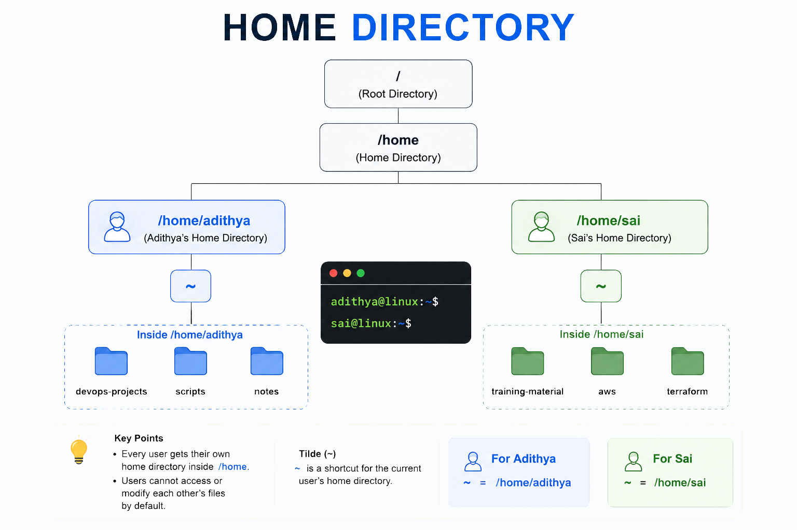

# Home Directory

When you log into a Linux server, you don't land in some random place. You land in **your home directory** — your personal space on the system.

---

## What is the Home Directory?

Every user on a Linux system gets their own **home directory** — a private folder where they can store their files, configurations, and scripts.

<div align="center">
  
</div>

---

## Where is It?

The home directory follows a simple pattern:

```
/home/<username>
```

| User | Home Directory |
|------|---------------|
| `adithya` | `/home/adithya` |
| `sai` | `/home/sai` |
| `ubuntu` (default AWS user) | `/home/ubuntu` |
| `ec2-user` (Amazon Linux) | `/home/ec2-user` |
| `root` (superuser) | `/root` ← **exception!** |

> 💡 The **root user** is special — its home directory is `/root`, not `/home/root`. This is because `/home` might be on a separate disk partition, and root needs to be able to log in even if that partition fails.

---

## The Tilde (`~`) Shortcut

Typing `/home/adithya` every time gets tedious. Linux provides a shortcut — the **tilde** character `~`.

```bash
# These are equivalent (if you're logged in as adithya):
cd /home/adithya
cd ~

# Print your home directory
echo ~
# Output: /home/adithya
```

The `~` **always expands to the current user's home directory**, regardless of who's logged in:

```bash
# Logged in as adithya:
echo ~          # /home/adithya

# Logged in as ubuntu:
echo ~          # /home/ubuntu

# Logged in as root:
echo ~          # /root
```

### Referencing Another User's Home

You can use `~username` to reference someone else's home directory:

```bash
echo ~sai       # /home/sai
echo ~root      # /root
```

---

## Navigating To and From Home

```bash
# Go to your home directory (3 ways — all equivalent)
cd
cd ~
cd /home/adithya

# Check where you are
pwd
# Output: /home/adithya

# Go somewhere else
cd /var/log

# Jump back home instantly
cd
pwd
# Output: /home/adithya
```

### Quick Trick: `cd -`

`cd -` takes you back to the **previous directory** you were in — like an "undo" for navigation:

```bash
pwd                    # /home/adithya
cd /var/log
pwd                    # /var/log
cd -                   # Switches back
pwd                    # /home/adithya
cd -                   # Switches again
pwd                    # /var/log
```

---

## The `$HOME` Environment Variable

Besides `~`, there's also an environment variable called `$HOME` that holds your home directory path:

```bash
echo $HOME
# Output: /home/adithya
```

`~` and `$HOME` are almost always interchangeable, but there's a subtle difference:

| Feature | `~` | `$HOME` |
|---------|-----|---------|
| Expanded by | The shell before command runs | The shell as a variable |
| Works in quotes | `"~"` → literal `~` ❌ | `"$HOME"` → `/home/adithya` ✅ |
| Best for | Quick terminal usage | Inside scripts |

```bash
# In scripts, prefer $HOME:
echo "Config path: $HOME/.bashrc"    # ✅ Works: /home/adithya/.bashrc
echo "Config path: ~/.bashrc"        # ✅ Works too (in most cases)
```

---

## Key Takeaways

- Every user has a **home directory** at `/home/<username>` (except root, which uses `/root`).
- **`~`** is a shortcut for your home directory — use it everywhere.
- `cd` with no arguments takes you **straight home**.
- `cd -` takes you back to the **previous directory**.
- Hidden files (starting with `.`) store your **shell configuration, history, and SSH keys**.
- Your home directory is **private** — other users can't access your files by default.
- In scripts, prefer **`$HOME`** over `~` for reliability.

---

**← Previous:** [Intro to Shell](./01-intro-to-shell.md) · **Next →** [Commands and Arguments](./03-commands-and-arguments.md)
