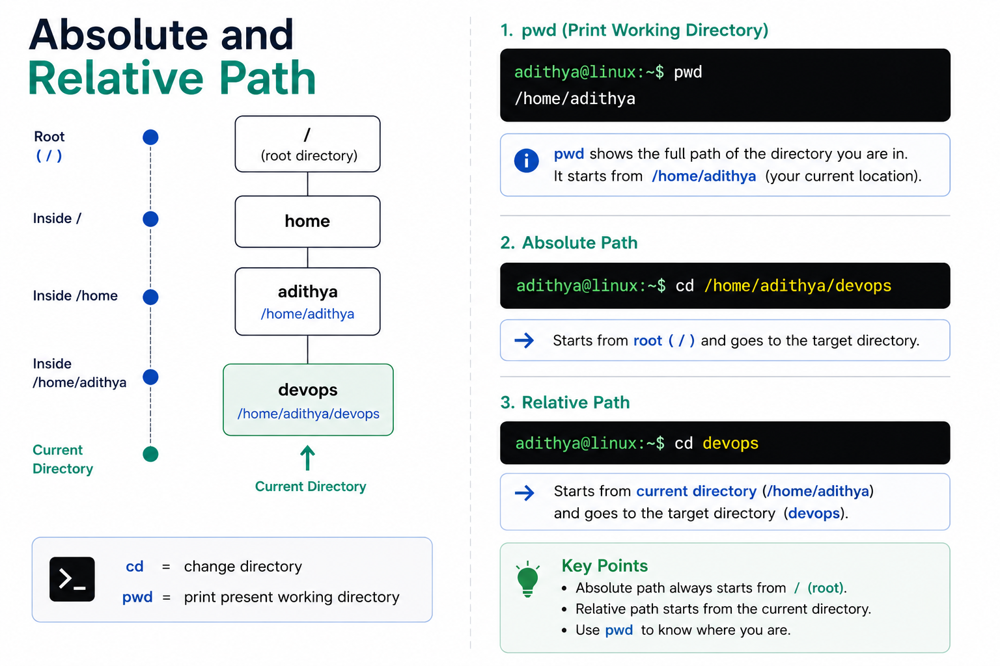

# Relative Path vs Absolute Path

When you tell Linux to do something with a file or directory, you need to tell it **where** that file is. You can describe that location in two ways — using an **absolute path** or a **relative path**.

This is one of those concepts that seems simple but trips people up all the time, especially inside scripts and automation. Let's nail it down.

---

<div align="center">
  
</div>

---

## The Linux File System Starts at `/`

Before talking about paths, remember that the Linux file system is a **tree** that starts at a single root: **`/`**

```
/                          ← root (the very top)
├── home/
│   ├── adithya/
│   │   ├── devops/
│   │   ├── scripts/
│   │   └── notes/
│   └── sai/
├── var/
│   └── log/
│       ├── syslog
│       └── auth.log
├── etc/
│   ├── nginx/
│   └── ssh/
└── tmp/
```

Every file on the system has a **unique address** in this tree. The question is: how do you express that address?

---

## Absolute Path

An absolute path describes the **full address** from the root (`/`) all the way to the target.

**It always starts with `/`.**

```bash
/home/adithya/devops
│
└── Starts from root (/)
```

### Examples

```bash
# These are all absolute paths — they start with /
/home/adithya/devops
/var/log/syslog
/etc/nginx/nginx.conf
/tmp/output.txt
```

### Using Absolute Paths

```bash
# You can use absolute paths from ANYWHERE on the system
cd /home/adithya/devops      # works no matter where you are
cat /var/log/syslog           # works no matter where you are
ls /etc/nginx/                # works no matter where you are
```

> 💡 **Absolute paths are like a full postal address** — "123 Main Street, City, State, Country." It doesn't matter where *you* are standing, the address always points to the same place.

---

## Relative Path

A relative path describes the location **relative to where you currently are** (your current working directory).

**It does NOT start with `/`.**

```bash
devops
│
└── Starts from current directory (no leading /)
```

### Examples

Let's say you're currently in `/home/adithya`:

```bash
pwd
# Output: /home/adithya
```

| Relative Path | What It Resolves To | Explanation |
|--------------|-------------------|-------------|
| `devops` | `/home/adithya/devops` | Go into `devops` from here |
| `devops/project1` | `/home/adithya/devops/project1` | Go deeper |
| `../sai` | `/home/sai` | Go up one level, then into `sai` |
| `../../var/log` | `/var/log` | Go up two levels, then into `var/log` |

### The Special Directory References

| Symbol | Meaning | Example |
|--------|---------|---------|
| `.` | **Current directory** | `./script.sh` = run script in current dir |
| `..` | **Parent directory** (one level up) | `cd ..` = go up one level |

```bash
# Starting at /home/adithya/devops

pwd                    # /home/adithya/devops

cd ..                  # go up → /home/adithya
cd ../..               # go up twice → /
cd ../sai              # go up, then into sai → /home/sai
```

> 💡 **Relative paths are like directions** — "go two blocks north, then turn left." They only make sense based on where *you're* standing.

---

## Side-by-Side Comparison

Starting from `/home/adithya`:

| Goal | Absolute Path | Relative Path |
|------|--------------|---------------|
| Go to devops folder | `cd /home/adithya/devops` | `cd devops` |
| Go to your home | `cd /home/adithya` | `cd ~` or just `cd` |

### Which Should I Use?

| Use | When | Why |
|-----|------|-----|
| **Absolute** | In **scripts and automation** | Scripts can run from any directory — absolute paths always work |
| **Absolute** | When the path is **short and clear** | `/etc/nginx/nginx.conf` is clear and unambiguous |
| **Relative** | For **quick terminal navigation** | `cd ..` is faster than typing the full path |
| **Relative** | When files are **near your current location** | `cat ./config.yml` is cleaner than the full path |

---

## Common Mistakes

### ❌ Mistake 1: Forgetting Where You Are

```bash
# You think you're in /home/adithya, but you're actually in /tmp
cd devops
# Error: No such file or directory

# Fix: Check first!
pwd                           # /tmp  ← not where you thought!
cd /home/adithya/devops       # use absolute path to be safe
```

### ❌ Mistake 2: Using Relative Paths in Scripts

```bash
# This script will BREAK if run from a different directory:
#!/bin/bash
cat logs/app.log              # relative — depends on where script is run from

# This script works from ANYWHERE:
#!/bin/bash
cat /var/log/app.log          # absolute — always correct
```

### ❌ Mistake 3: Confusing `/home` and `home`

```bash
cd /home      # absolute → goes to /home directory from root
cd home       # relative → looks for a folder called "home" in current directory
```

That single `/` at the start makes all the difference.

---

## Useful `pwd` Patterns

```bash
# Always know where you are
pwd
# Output: /home/adithya/devops

# Use pwd in scripts to build dynamic absolute paths
CURRENT_DIR=$(pwd)
echo "Working from: $CURRENT_DIR"
```

---

## Key Takeaways

- **Absolute path** starts with `/` → full address from root. Works from anywhere.
- **Relative path** has no leading `/` → address relative to your current directory.
- `.` means **current directory**, `..` means **parent directory**.
- Use **absolute paths in scripts** for reliability.
- Use **relative paths on the terminal** for speed.
- Always check where you are with `pwd` when in doubt.
- A missing or extra `/` at the start completely changes where a path points to.

---

**← Previous:** [Commands and Arguments](./03-commands-and-arguments.md) · **Next →** [Data Streams](../03-io-and-data-streams/01-data-streams.md)
