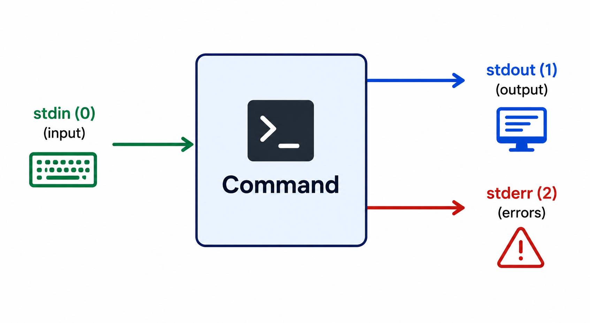
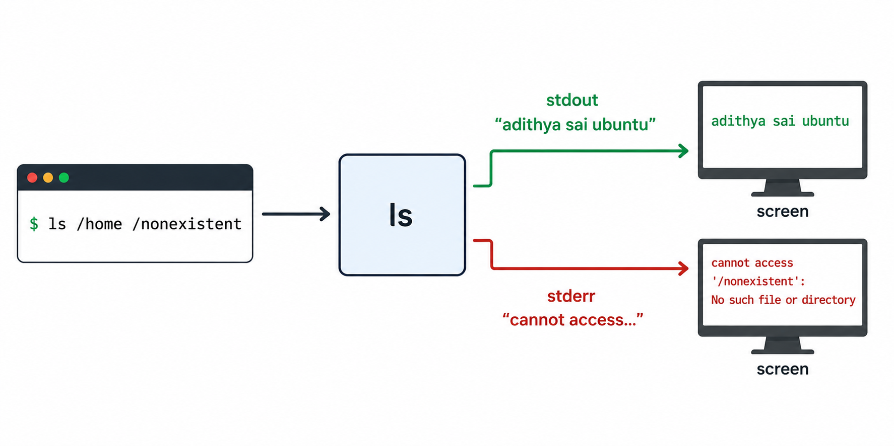

# Data Streams — stdin, stdout, and stderr

Every time you run a command in Linux, there are **three invisible channels** of data flowing in and out. Understanding these channels is key to understanding how commands communicate.

---

## The Three Data Streams

Every Linux command — whether it's `ls`, `grep`, `cat`, or your own script — automatically gets connected to **three data streams**:

<div align="center">
  
</div>

| Stream | Number | Direction | What It Carries |
|--------|--------|-----------|----------------|
| **stdin** (Standard Input) | `0` | **Into** the command | Data the command reads — keyboard input, file contents, output from another command |
| **stdout** (Standard Output) | `1` | **Out of** the command | The command's normal output — results, data, success messages |
| **stderr** (Standard Error) | `2` | **Out of** the command | Error messages, warnings, diagnostic info |

> 💡 The numbers `0`, `1`, and `2` are called **file descriptors**. They're how Linux internally identifies each stream.

---

## stdin — Standard Input

**stdin** is how a command receives input. By default, it reads from your **keyboard**.

```bash
# 'cat' with no arguments reads from stdin (your keyboard)
cat
hello         ← you type this
hello         ← cat echoes it back (stdout)
world         ← you type this
world         ← cat echoes it back
# Press Ctrl+D to stop
```

Some commands **wait for stdin** if you don't give them a file to work with:

```bash
# These read from stdin (keyboard) when no file is given:
cat           # waits for you to type, echoes it back
wc            # waits for input, then counts lines/words/characters
sort          # waits for input, then sorts it
grep "hello"  # waits for input, searches for "hello" in what you type
```

Other commands **don't use stdin** at all — they get everything they need from arguments:

```bash
ls /home      # doesn't read stdin — just lists the directory
pwd           # doesn't read stdin — just prints current directory
date          # doesn't read stdin — just shows the date
```

---

## stdout — Standard Output

**stdout** is where a command sends its **normal results**. By default, it goes to your **screen**.

```bash
ls /home
# stdout → adithya  sai  ubuntu    (printed on screen)

echo "Hello World"
# stdout → Hello World             (printed on screen)

cat /etc/hostname
# stdout → my-server               (printed on screen)

date
# stdout → Sun Jun  8 10:30:00 IST 2025  (printed on screen)
```

Every successful result you see on screen is coming through **stdout**.

---

## stderr — Standard Error

**stderr** is a **separate channel** for error messages and warnings. By default, it also goes to your **screen** — which is why it looks the same as stdout.

```bash
ls /nonexistent
# stderr → ls: cannot access '/nonexistent': No such file or directory

cat /some/missing/file
# stderr → cat: /some/missing/file: No such file or directory

cd /root
# stderr → bash: cd: /root: Permission denied
```

---

## Why Are stdout and stderr Separate?

This is the important question. If both show up on screen, **why have two separate streams?**

Consider this command:

```bash
ls /home /nonexistent
```

This produces **both** output and an error:

```
ls: cannot access '/nonexistent': No such file or directory    ← stderr
adithya  sai  ubuntu                                           ← stdout
```

On screen, they look mixed together. But internally, they're flowing through **different channels**:

<div align="center">
  
</div>

**The reason they're separate:** It lets you handle them differently later. For example:
- You might want to **save the results** to a file but still **see the errors** on screen
- You might want to **hide errors** but keep the output
- You might want to **log errors** to a different file for debugging

This separation is what makes Linux commands so flexible and composable. You'll learn how to take advantage of this with **redirection and pipes** when we cover those topics.

---

## How to Tell If Something Is stdout or stderr

On screen, they look identical. But there's a quick way to tell — try sending the output somewhere:

```bash
# If a command succeeds, the output is stdout
echo "hello"
# Output: hello                    ← this is stdout

# If a command fails, the message is stderr
ls /fake_directory
# Output: ls: cannot access...    ← this is stderr
```

**General rule:**
- ✅ **Successful results** → stdout
- ❌ **Error messages** → stderr
- ℹ️ **Warnings / diagnostics** → stderr

---

## A Real-World Analogy

Think of a **customer service call**:

| Stream | Analogy |
|--------|---------|
| **stdin** | **Your question** — what you say to the agent |
| **stdout** | **The answer** — the helpful information they give you |
| **stderr** | **"I'm sorry, I can't find that"** — error or problem messages |

You (stdin) ask a question → the agent processes it → you get either an answer (stdout) or an error message (stderr). Sometimes you get both.

---

## Key Takeaways

- Every command has **three streams**: **stdin** (input), **stdout** (output), **stderr** (errors).
- They're identified by **file descriptors**: `0` (stdin), `1` (stdout), `2` (stderr).
- By default, **stdin** reads from the keyboard, and **both stdout and stderr** print to the screen.
- **stdout** carries normal results. **stderr** carries error messages.
- They look the same on screen, but they're **separate channels** — this separation is what makes Linux commands flexible and powerful.

---

**← Previous:** [Relative Path vs Absolute Path](../02-shell-and-navigation/04-relative-vs-absolute-path.md) · **Back to** [Linux Home](../README.md)
